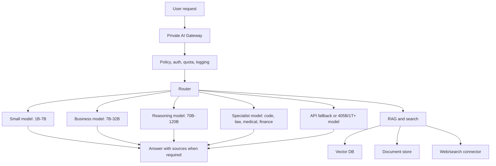

# Private AI Deployment Plan

Last updated: 2026-07-22

## Goal

Build a private AI platform that a company can run for internal users without
sending sensitive company data to public chat tools by default. The platform
should support chat, document search, RAG, web search with references, coding
help, document drafting, multilingual support, image/OCR, voice, admin controls,
audit logs, and usage billing.

The same architecture can support:

- Small company: 50 monthly users.
- Medium company: 500 monthly users.
- Large company: 1000 monthly users.
- Enterprise/private government deployment: 1000+ users with strict security.

## Core Principle

Do not use one giant model for every message. Use a router and specialist model
stack.

## Platform Modules

| Module | Purpose | Recommended tools |
|---|---|---|
| AI gateway | Single secure API for chat, docs, RAG, tools, and billing | FastAPI, Node.js, Nginx, Envoy |
| Model router | Selects small, medium, high, or API model by request | Custom router, rule + embedding classifier |
| Model serving | Runs open models privately | vLLM, TGI, llama.cpp, TensorRT-LLM |
| RAG system | Reduces hallucination and uses company knowledge | LlamaIndex, LangChain, custom pipeline |
| Vector DB | Retrieval for documents and memories | Qdrant, Milvus, pgvector, Weaviate |
| Embeddings | Multilingual search | BGE-M3, Nomic Embed, E5 |
| Document parser | PDF, Word, Excel, web pages, OCR | Unstructured, Docling, Tesseract, PaddleOCR |
| Web search | Current information with links | Brave Search API, SerpAPI, Tavily, Bing API |
| Voice | Speech-to-text and text-to-speech | Whisper, faster-whisper, Piper, ElevenLabs option |
| Admin dashboard | Users, plans, models, logs, security, usage | Next.js, React, PostgreSQL |
| Monitoring | Reliability and cost tracking | Prometheus, Grafana, OpenTelemetry, Sentry |
| Security | Enterprise controls | SSO, RBAC, audit logs, encryption, DLP |

## Hosting Platforms

### Best Platforms For Fast Start

| Platform | Best for | Notes |
|---|---|---|
| Lambda Cloud | Dedicated GPU instances and clusters | Good for H100, H200, B200 private AI hosting and reserved GPU capacity. |
| RunPod | Fast experiments, GPU workers, serverless inference | Good for pilots and lower-cost model serving if compliance needs are moderate. |
| AWS | Enterprise production, compliance, VPC, IAM, private networking | Best when company already uses AWS and needs governance. |
| Google Cloud | Enterprise AI, GKE, Vertex ecosystem, committed discounts | Good for Kubernetes-based deployments and committed use discounts. |
| Azure | Microsoft enterprise, Entra ID, Microsoft 365, regulated workloads | Best if customer uses Microsoft stack and wants SSO with Entra ID. |
| Oracle Cloud | Enterprise GPU clusters and private network workloads | Often attractive for large GPU reservations. |
| CoreWeave | GPU-heavy enterprise AI clusters | Strong for large-scale GPU workloads and managed Kubernetes. |
| On-prem server | Maximum data control | Best for banks, law firms, hospitals, government, and strict data residency. |
| Hybrid | Private data plus cloud burst | Best default for serious companies: local RAG and private data, cloud GPUs for spikes. |

### Recommended Hosting By Company Size

| Company size | Recommended hosting | Why |
|---|---|---|
| 50 users | Single private cloud GPU or on-prem workstation/server | Lowest cost and simple management. |
| 500 users | Private VPC with 2-4 GPUs, managed DB, object storage, vector DB | Enough capacity, uptime, and security for departments. |
| 1000 users | GPU cluster with load balancing, autoscaling, HA DB, separate RAG workers | Handles concurrency, audit, and production reliability. |
| Regulated enterprise | On-prem or private cloud with dedicated GPU nodes | Data control, compliance, audit, and predictable cost. |

## Model Strategy

| TORKA model class | Base size | Purpose | Routing rule |
|---|---:|---|---|
| TORKA Tiny | 1B-3B | Greetings, simple writing, routing, summaries | Use first for low-risk prompts. |
| TORKA Mini | 7B-14B | Normal chat, multilingual, business support | Default for most company users. |
| TORKA Pro | 32B-70B | complex writing, coding, analysis, long answers | Use when quality matters. |
| TORKA Think | 70B-120B | reasoning, planning, math, strategy | Use when prompt needs step-by-step thinking. |
| TORKA Expert | 120B-405B | legal, finance, enterprise proposals, complex research | Use with RAG and review. |
| TORKA Ultra | 1T-1.5T+ | highest quality private model | Use only for very high-value deployments. |

## Specialist Models

| Area | Model path | Knowledge source |
|---|---|---|
| Law and contracts | torka-law | Legal RAG, official laws, case law, contract templates |
| Visa and immigration | torka-visa-law | Official immigration rules and uploaded documents |
| Company compliance | torka-company-law | Company law, tax guidance, internal policies |
| Government | torka-gov | Official government websites, circulars, PDFs |
| Statistics and data | torka-statistics | Python tools, calculators, CSV/Excel files |
| Multilingual | torka-multilingual | multilingual LLM + BGE-M3 RAG |
| Coding | torka-coder | Qwen Coder, DeepSeek Coder style stack |
| Medical | torka-medical | Medical RAG, disclaimers, expert review |
| Vision and OCR | torka-vision | Qwen-VL or similar vision model plus OCR |
| Voice | torka-voice | Whisper/faster-whisper and TTS |

Important rule: law, visa, tax, company compliance, government, finance, and
medical answers must use RAG and references. The model should not answer from
memory only.

## Deployment Packages

### Package 1: Small Company Private AI

Best for: 50 users, small team, agency, school, clinic, local business.

Recommended stack:

- 1B-7B local model for simple chat.
- 7B-14B model for normal writing and support.
- RAG with uploaded documents.
- Web search with references.
- Basic admin dashboard.
- Daily usage limit and department-level access control.

Expected one-time setup:

- USD 10,000 to USD 35,000.

Expected monthly cost:

- Hosting: USD 900 to USD 3,500.
- Maintenance/support: USD 1,200 to USD 4,000.
- Total: USD 2,500 to USD 8,500 per month.

Best hosting:

- Lambda Cloud, RunPod Secure Cloud, AWS single-GPU deployment, or one on-prem GPU server.

### Package 2: Medium Company Private AI

Best for: 500 users, medium business, BPO, SaaS company, regional enterprise.

Recommended stack:

- 7B-14B default model.
- 32B model for better business writing and document drafting.
- 70B model or API fallback for complex work.
- RAG for company docs, policies, contracts, SOPs, HR, support knowledge base.
- SSO, RBAC, audit logs, team usage, admin billing.
- Backup and disaster recovery.

Expected one-time setup:

- USD 35,000 to USD 120,000.

Expected monthly cost:

- Hosting: USD 6,000 to USD 22,000.
- Maintenance/support: USD 5,000 to USD 15,000.
- Total: USD 13,000 to USD 45,000 per month.

Best hosting:

- AWS, Google Cloud, Azure, Lambda reserved GPU, CoreWeave, or hybrid cloud.

### Package 3: Large Company Private AI

Best for: 1000 users, national enterprise, bank, hospital group, university, government department.

Recommended stack:

- 14B-32B default model.
- 70B model for higher quality answers.
- 120B-405B specialist or external API fallback for high-value requests.
- Dedicated RAG workers.
- Full observability and audit.
- HA database, HA vector DB, object storage, backups, DR.
- Data retention policy, DLP, SSO, SCIM, SAML/OIDC.
- Department-level models and permissions.

Expected one-time setup:

- USD 90,000 to USD 300,000.

Expected monthly cost:

- Hosting: USD 18,000 to USD 85,000.
- Maintenance/support: USD 12,000 to USD 35,000.
- Total: USD 35,000 to USD 140,000 per month.

Best hosting:

- AWS, Google Cloud, Azure, Oracle Cloud, CoreWeave, Lambda clusters, or on-prem GPU cluster.

### Package 4: Enterprise 1T To 1.5T+ Private AI

Best for: very large enterprise, government, telco, finance, national AI program,
or AI provider serving many customers.

Recommended stack:

- 405B to 1.5T+ model class with tensor parallelism.
- 32 to 64+ high-memory GPUs.
- Dedicated inference cluster.
- Dedicated RAG, embedding, reranking, and agent workers.
- Separate dev, staging, and production environments.
- Enterprise SOC2/ISO-aligned controls.
- 24/7 support and GPU operations team.

Expected one-time setup:

- USD 300,000 to USD 1,500,000+.

Expected monthly cost:

- GPU hosting alone: USD 150,000 to USD 575,000+.
- Platform, security, maintenance, support: USD 35,000 to USD 120,000+.
- Total: USD 200,000 to USD 750,000+ per month.

Best hosting:

- CoreWeave, Lambda Supercluster, AWS Capacity Blocks, Oracle Cloud GPU cluster,
  Google Cloud reserved GPU, Azure ND/GB series, or dedicated on-prem GPU cluster.

## Implementation Roadmap

### Phase 1: Discovery And Security Design

Timeline: 1 week.

Deliverables:

- User roles and permissions.
- Data classification.
- Documents and data sources.
- Required integrations.
- Compliance checklist.
- Deployment target selection.

### Phase 2: MVP Private AI

Timeline: 2 to 3 weeks.

Deliverables:

- Chat UI.
- Private API gateway.
- Local model serving.
- RAG ingestion for documents.
- Vector DB.
- Usage tracking.
- Basic admin settings.

### Phase 3: Production AI Router

Timeline: 2 to 3 weeks.

Deliverables:

- Model router: small, medium, high, API fallback.
- RAG-first high-risk answers.
- Prompt policy.
- Source citations.
- Rate limits and quota.
- Logging and evaluation.

### Phase 4: Enterprise Hardening

Timeline: 2 to 4 weeks.

Deliverables:

- SSO/SAML/OIDC.
- RBAC/ABAC.
- Audit logs.
- Backups.
- Monitoring and alerting.
- DLP and retention rules.
- Security testing.

### Phase 5: Pilot And Scale

Timeline: 4 to 8 weeks.

Deliverables:

- 50-user pilot.
- User feedback and answer-quality testing.
- Cost optimization.
- Scale to 500 users.
- Scale to 1000 users.

## Cost Control Rules

1. Use RAG before using a larger model.
2. Cache repeated answers and retrieved context.
3. Route simple prompts to 1B-7B models.
4. Route documents, code, and long reasoning to 32B-70B models.
5. Use 120B+ only for high-value work.
6. Use API fallback only when private models fail or the plan allows it.
7. Use batching and streaming for inference.
8. Use quantized models where quality is acceptable.
9. Put daily usage limits on free and low-cost plans.
10. Track token, request, and GPU cost per user and department.

## Recommended Default Architecture For TORKA

For commercial deployment, start with this:

- TORKA Tiny: 1B-3B for simple tasks.
- TORKA Mini: 7B-14B for standard chat.
- TORKA Pro: 32B-70B for professional output.
- TORKA Think: 70B-120B for reasoning.
- TORKA Expert: 120B-405B or API fallback for high-value work.
- RAG: always enabled for company, legal, medical, finance, tax, visa, and government.
- Web search: enabled for current info, people, news, pricing, laws, products, and local recommendations.
- Admin: user limits, plan, credits, logs, source auditing, and model routing.

## Final Recommendation

For 50 to 1000 users, the best business option is not a 1.5T model from day one.
The best option is a private AI platform with routing, RAG, small-to-large
models, and optional API fallback. This gives the company privacy, speed, and
reasonable monthly cost while keeping a path to larger models later.
