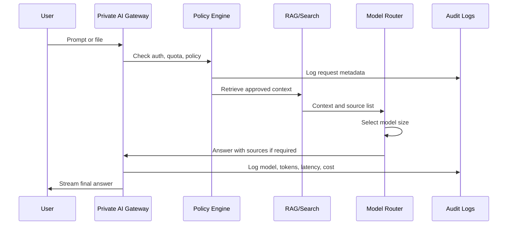

# Security And Compliance Plan

Last updated: 2026-07-22

Private AI is only valuable if the company can trust where the data goes, who
can access it, and how it is logged. This document lists the required controls
for small, medium, large, and regulated deployments.

## Security Baseline

| Control | Requirement |
|---|---|
| Authentication | SSO with OIDC/SAML for enterprise; email login for small teams |
| Authorization | RBAC by role, department, workspace, and data source |
| Data encryption | TLS in transit and encryption at rest |
| Network | Private VPC, VPN, private subnets, security groups |
| Audit logs | Every login, prompt, file upload, model call, admin action |
| Retention | Configurable message, file, and log retention |
| Data training | Customer data is not used for model training unless explicitly enabled |
| DLP | Detect secrets, private keys, health data, financial data, and PII |
| Backups | Daily backups for DB and document index |
| Disaster recovery | Restore plan with RPO/RTO targets |
| Monitoring | Latency, GPU use, token use, failures, cost alerts |
| Admin controls | User limits, plan limits, model access, web access, export controls |

## Regulated Answer Rules

The AI must use RAG and source references for:

- Medical.
- Legal.
- Visa and immigration.
- Tax.
- Finance.
- Government policy.
- Company compliance.
- HR policy.
- Safety-critical technical work.

The AI should refuse or qualify answers when:

- No reliable source is found.
- The answer would require professional legal, medical, or financial judgment.
- The user asks for instructions that create security, fraud, or safety risks.

## Deployment Security Levels

### Level 1: Private Team

Best for small companies.

Required:

- Private app login.
- Encrypted DB.
- Basic audit logs.
- Workspace file permissions.
- Admin can delete user data.

### Level 2: Enterprise Department

Best for medium companies.

Required:

- SSO.
- RBAC.
- Private VPC.
- Central audit logs.
- Model usage limits.
- File access by department.
- DLP scanning.
- Backups and restore testing.

### Level 3: Regulated Enterprise

Best for banks, hospitals, law firms, government, and large enterprises.

Required:

- SAML/OIDC SSO.
- SCIM provisioning.
- RBAC/ABAC.
- Tenant isolation.
- Private networking.
- Customer-managed keys where possible.
- Data retention policies.
- Legal hold support.
- SIEM export.
- Security review and penetration test.
- DR plan and incident response runbook.

## Data Flow

## Data Retention Defaults

| Data type | Default retention | Enterprise option |
|---|---:|---|
| Chat messages | 180 days | 7 days to permanent archive |
| Uploaded files | 180 days | Per workspace policy |
| Audit logs | 365 days | 7 years |
| Vector chunks | Same as source file | Source-controlled |
| Usage records | 365 days | 7 years |
| Error logs | 90 days | 365 days |

## Backup Plan

| Component | Backup frequency | Restore target |
|---|---:|---|
| PostgreSQL | Daily + point-in-time recovery | 1-4 hours |
| Object storage | Versioned bucket | 1-4 hours |
| Vector DB | Daily snapshot | 4-8 hours |
| Configuration | Git + encrypted secrets backup | 1 hour |
| Models | Re-downloadable plus model registry | 4-24 hours |

## Compliance Notes

Private AI deployments can be aligned with SOC 2, ISO 27001, HIPAA, GDPR, and
local data protection rules, but compliance depends on the customer environment,
policies, audits, and operating practices.

Do not claim certification unless a third-party audit has been completed.

## Enterprise Support Levels

| Support level | Response time | Included |
|---|---:|---|
| Basic | 2 business days | Updates, bug fixes, monthly report |
| Business | 1 business day | Monitoring, monthly RAG refresh, admin support |
| Enterprise | 4 hours | Priority fixes, security support, uptime reporting |
| Mission critical | 1 hour | 24/7 support, incident response, dedicated engineer |

## Final Security Recommendation

For small companies, start simple but keep logs and access control from day one.
For medium and large companies, do not deploy without SSO, RBAC, audit logs, data
retention, backups, and a clear rule that customer data is not used for training
without explicit permission.
